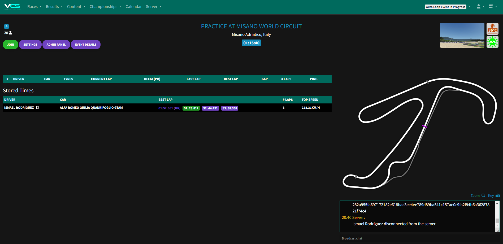
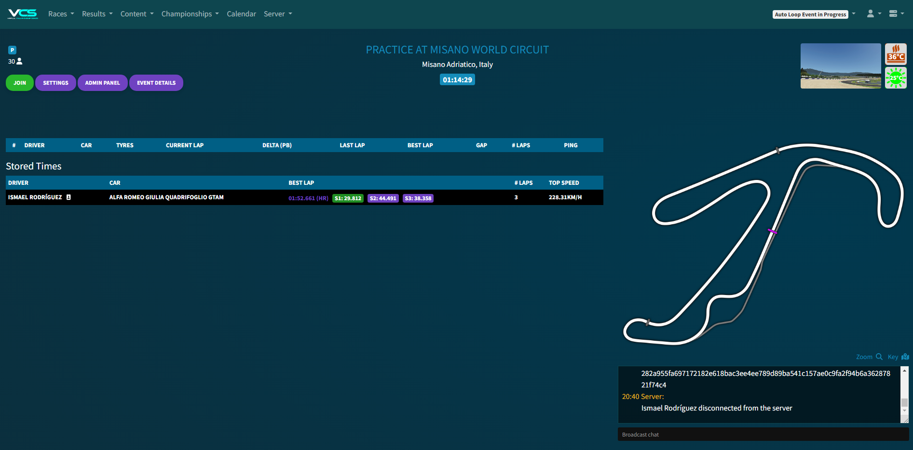
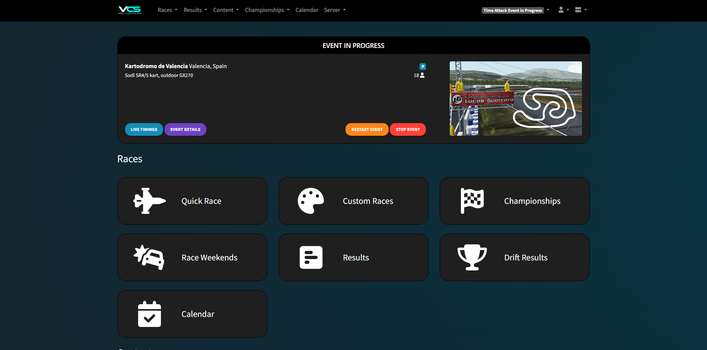
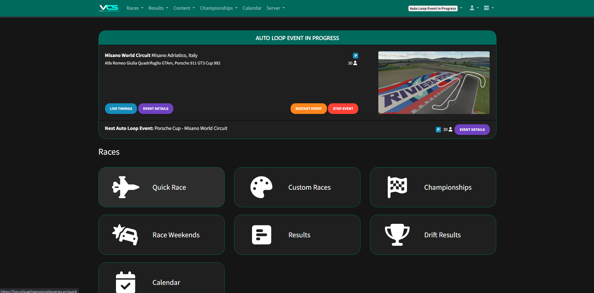

# ac-server-manager-css-revamp

Proyecto simple de actualización del conjunto de estilos para dar una visualización de aspecto más moderno en la aplicación de https://github.com/JustaPenguin/assetto-server-manager
* Disponemos de 2 diferentes estilos, 1 con background animado y otro con background simple
* Dicho CSS debe aplicarse en la integración proporcionada por el desarrollador para introducir Custom CSS, tal cual figure en cada style.css
* Se ha intentado simplificar el uso del mismo a través de variables, para facilitar la customización (Combinación de colores, duración de animaciones)
* El diseño está activo y aplicado en https://servermanager.joboufra.es/live-timing?server=1

Live timing: 

Paneles:

